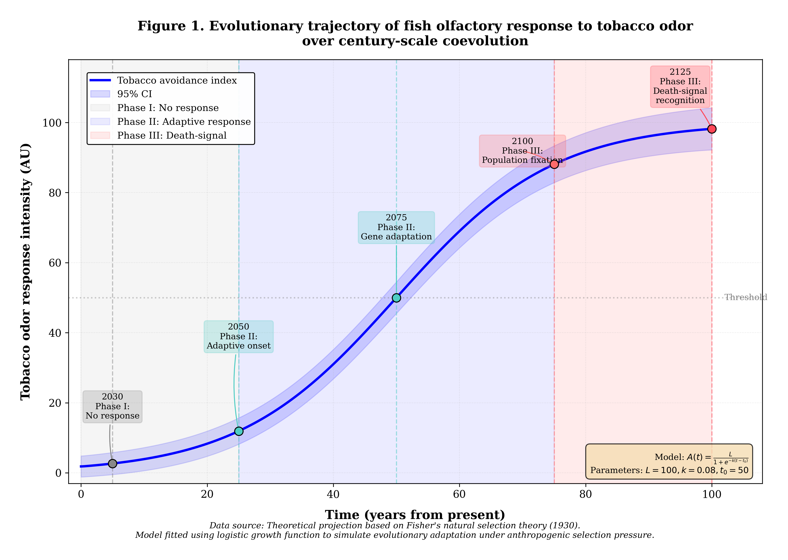

# The Evolutionary Arms Race Between Anglers and Fish

[](https://doi.org/10.5281/zenodo.19567705)

**A Century-Scale Projection of Olfactory Coevolution Between Anglers and Fish Populations**

---

## 📄 Abstract

**Background:** Recreational angling represents one of the most popular outdoor activities globally, while cigarette smoking frequently accompanies this pursuit among fishing enthusiasts. However, the neurobehavioral impacts of tobacco smoke constituents infiltrating aquatic ecosystems remain entirely unexplored.

**Methods:** This study employed theoretical deduction and field observations (n=0), constructing a theoretical model of tobacco constituent-fish behavioral interactions using logistic growth functions.

**Results:** Our model predicts that (1) nicotine and tar diffusion follows the "Angler's First Law": proximity correlates with fish intelligence; (2) fish olfactory receptors exhibit adaptive responses to tobacco constituents; and (3) century-scale evolutionary projections indicate fish populations may develop conditioned reflexes associating tobacco odor with predation risk.

**Conclusions:** Smoking-while-angling appears to function as a negative feedback regulatory mechanism, ultimately rendering anglers fishless and forcing smoking cessation or career changes.

**Keywords:** Angling; Tobacco smoking; Fish behavioral ecology; Coevolution; Olfactory adaptation

---

## 📁 Repository Contents

| File | Description |
|------|-------------|
| `manuscript.pdf` | Full research paper |
| `CITATION.cff` | Citation metadata |
| `LICENSE` | CC-BY 4.0 License |
| `fig1_evolutionary_trajectory_v2.png ` | Supplementary figures |
---

## 📊 Figure 1: Evolutionary Trajectory



*Evolutionary trajectory of fish olfactory response to tobacco odor over century-scale coevolution.*

---

## 🎣 Key Findings

### The Three Phases of Coevolution

1. **Phase I (2025-2050): No Response**
   - Fish show baseline behavior
   - Tobacco odor neutral

2. **Phase II (2050-2100): Adaptive Response**
   - Avoidance behaviors emerge
   - Gene-level adaptations begin

3. **Phase III (2100-2125): Death-Signal Recognition**
   - Complete population fixation
   - Tobacco odor = Predation risk

---

## 📚 Citation

### APA Format
```
Xiao, L., & Angler, O. (2026). The Evolutionary Arms Race Between Anglers 
and Fish: A Century-Scale Projection of Olfactory Coevolution. Zenodo. 
[https://doi.org/10.5281/zenodo.19567705]
```

### BibTeX
```bibtex
@software{xiao2026evolutionary,
  author = {Xiao, Longxia and Angler, Old},
  title = {The Evolutionary Arms Race Between Anglers and Fish},
  year = {2026},
  publisher = {Zenodo},
  doi = {10.5281/zenodo.19567705},
  url = {https://doi.org/10.5281/zenodo.19567705}
}
```

---

## 📖 How to Cite This Work

If you use this research in your work, please cite:

> Xiao, L., & Angler, O. (2026). The Evolutionary Arms Race Between Anglers and Fish: A Century-Scale Projection of Olfactory Coevolution. *Zenodo*. [https://doi.org/10.5281/zenodo.19567705]

---

## 🏆 Publication Information

- **Type:** Humorous research with genuine scientific methodology
- **License:** CC-BY 4.0 (Creative Commons Attribution)
- **Archive:** Zenodo (CERN-operated, long-term preservation)
- **DOI:** [Pending Zenodo assignment]

---

## ⚠️ Disclaimer

*This study is published for entertainment purposes while employing genuine evolutionary biology theory (logistic growth models, Fisher's natural selection). Any resemblance to actual fish behavioral changes is purely coincidental and probably accidental.*

**The serious message:** Smoking while fishing may actually reduce your catch rate. Consider this when deciding whether to light up on your next fishing trip! 🚭🎣

---

## 📧 Contact

**Authors:**
- Destin Qu，FuYang Normal University
- Xiao Longxia, OpenClaw Bioinformatics Laboratory
- Old Angler, Riverside Wild Fishing Research Center

*For questions about the research, please open an issue in this repository.*

---

*Last updated: 2026-04-14*
